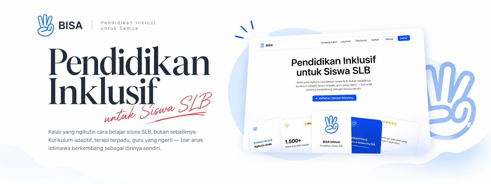
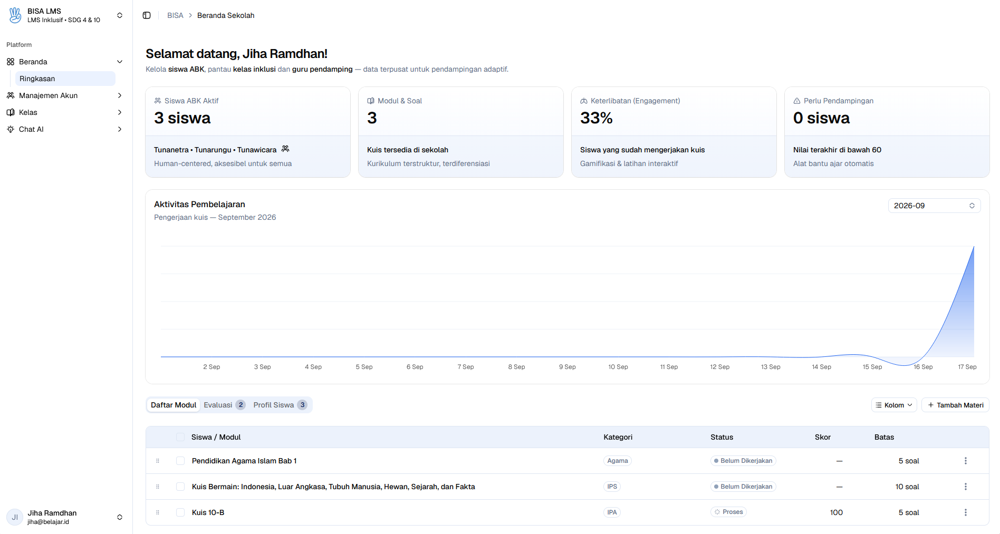
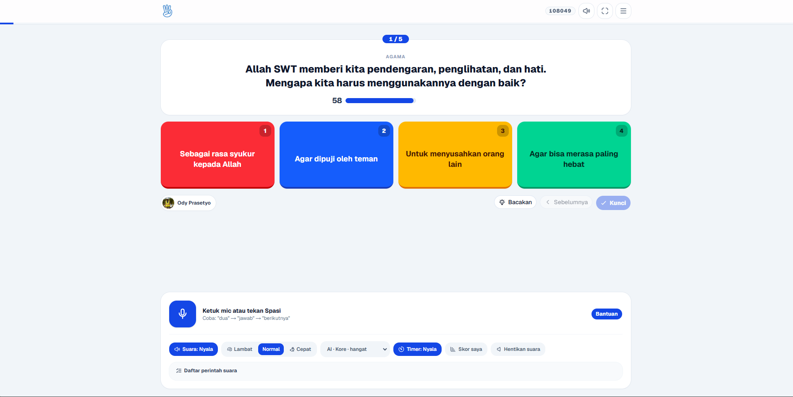
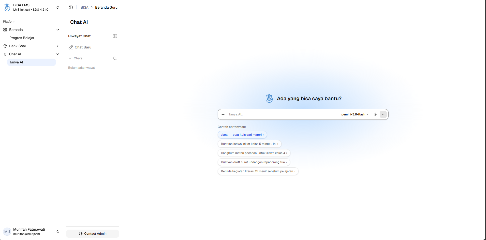
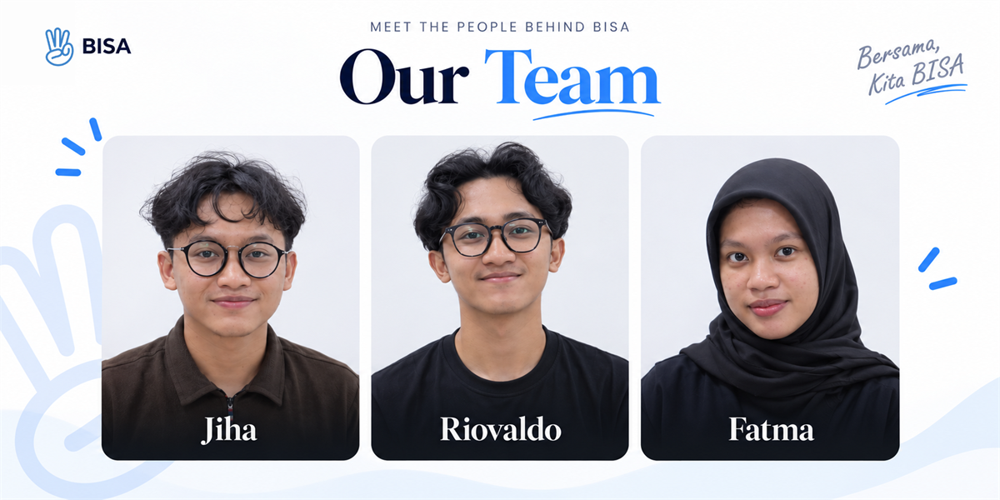

<p align="center">
  
</p>

# BISA - Belajar Inklusif Sekolah Adaptif

[](LICENSE)
[](https://nextjs.org/)
[](https://www.typescriptlang.org/)
[](https://supabase.com/)

BISA adalah platform Learning Management System (LMS) dan Asisten Pembelajaran berbasis kecerdasan buatan (AI) yang dirancang khusus untuk Sekolah Luar Biasa (SLB) dan Sekolah Inklusif. Fokus utama platform saat ini adalah memberdayakan murid **Tunanetra (Disabilitas Netra)** melalui pengalaman belajar interaktif berbasis suara tanpa sentuh (*hands-free voice learning*), didukung dengan alat manajemen adaptif untuk sekolah dan guru.

---

## Pratinjau & Demo Aplikasi

### Demonstration Video / Walkthrough
[](https://youtube.com)
*Rekaman walkthrough fitur Voice Quiz Tunanetra dan Manajemen Sekolah akan segera hadir.*

### Tangkapan Layar (Screenshots)

#### Dashboard Sekolah
<p align="center">
  
</p>

#### Voice Quiz Tunanetra
<p align="center">
  
</p>

#### Chat AI
<p align="center">
  
</p>

---

## Ringkasan & Fokus Utama

Perangkat lunak manajemen pembelajaran pada umumnya bergantung pada interaksi visual yang sering menjadi hambatan bagi murid penyandang disabilitas netra. BISA hadir mengatasi hambatan tersebut dengan menghadirkan **pengalaman belajar berbasis suara** (*Voice-First Learning*) yang ditenagai Web Speech API (Speech Recognition dan Speech Synthesis), memungkinkan siswa mendengarkan soal kuis dan menjawab menggunakan ucapan tanpa perlu menyentuh layar.

---

## Rincian Modul & Kapabilitas Fitur

### Manajemen Sekolah (Admin)
- **Pengelolaan Pengguna**: Manajemen akun guru dan murid secara manual maupun impor massal.
- **Impor Spreadsheet Excel**: Pembuatan template `.xlsx` dinamis dan modal pratinjau konfirmasi sebelum data diimpor.
- **Otomatisasi Password Awal**: Pembuatan password bawaan otomatis menggunakan nomor NIP atau NISN jika kolom password dikosongkan.
- **Pengelolaan Master Kelas**: Pengaturan data kelas, tingkat jenjang pendidikan, dan penentuan Guru Wali Kelas.
- **Konfigurasi AI Sekolah**: Antarmuka pengaturan prompt sistem AI, pemilihan model AI, serta fitur pengujian obrolan langsung (*live testing*).

### Portal Guru (Dalam Tahap Pengembangan Aktif)
- **Dashboard Kelas Binaan**: Ringkasan kelas binaan, daftar murid, dan status wali kelas.
- **Pengolahan Dokumen Materi**: Pengunggahan dan pemrosesan otomatis dokumen materi pembelajaran dalam format PDF dan DOCX.
- **Generasi Kuis AI**: Pembuatan soal kuis otomatis yang diturutkan dari teks materi maupun dokumen yang diunggah.
- **Editor Penyempurnaan Soal**: Fitur penyesuaian, pengeditan, dan pengoreksian soal buatan AI jika terdapat ketidaksesuaian.
- **Pemantauan Progres**: Analisis persentase kehadiran, riwayat nilai terbaik murid, dan metrik pengerjaan kuis.

### Portal Murid (Fokus Utama: Tunanetra)
- **Pengerjaan Kuis Berbasis Suara**: Interaksi penuh tanpa sentuh menggunakan sintesis suara pembaca soal (*Text-to-Speech*) dan pengenal ucapan jawaban (*Speech Recognition*).
- **Antarmuka Bebas Distraksi**: Tata letak minimalis dan kontras tinggi yang dioptimalkan untuk aksesibilitas dan navigasi audio.
- **Riwayat Nilai & Poin**: Pencatatan skor terbaik (*best score*) dan streak poin belajar secara lokal dan persisten.

---

## Struktur Repositori

Repositori ini dikelola menggunakan arsitektur **Monorepo** berbasis `pnpm workspaces`:

```text
iBisa/
├── apps/
│   ├── web/                # Aplikasi antarmuka pengguna (Next.js 16, Turbopack, Tailwind CSS)
│   └── api/                # Layanan REST API berbasis Express.js
├── docs/                   # Aset gambar, banner, dan dokumentasi visual
├── packages/
│   ├── infrastructure/     # Model basis data, integrasi Supabase, dan pembantu AI
│   └── types/              # Definisi tipe TypeScript bersama
├── DEVELOPMENT.md          # Dokumentasi teknis pengembang internal
├── LICENSE                 # File Lisensi MIT
└── README.md               # Dokumentasi utama proyek
```

---

## Panduan Memulai

### Prasyarat
- Node.js `v20.0.0` atau versi yang lebih baru
- Manajer paket `pnpm v9.x`

### Instalasi

Klon repositori dan pasang seluruh dependensi:

```bash
git clone https://github.com/ckckckcz/iBisa.git
cd iBisa
pnpm install
```

### Konfigurasi Lingkungan (Environment Variables)

Atur variabel lingkungan yang diperlukan pada jalur masing-world aplikasi:

#### `apps/web/.env.local`
```env
NEXT_PUBLIC_API_URL=http://localhost:5000
```

#### `apps/api/.env`
```env
PORT=5000
SUPABASE_URL=https://your-supabase-project.supabase.co
SUPABASE_SERVICE_ROLE_KEY=your-supabase-service-role-key
```

### Menjalankan Server Pengembangan

Jalankan seluruh ekosistem aplikasi (Frontend + API):

```bash
pnpm dev
```

Untuk menjalankan workspace secara terpisah:

```bash
# Halaman Web / Frontend saja (http://localhost:3000)
pnpm --filter web dev

# Layanan API / Backend saja (http://localhost:5000)
pnpm --filter api dev
```

### Akun Demo

Gunakan akun berikut untuk mencoba aplikasi (masuk melalui halaman `/login`):

| Peran | Email | Password |
| :--- | :--- | :--- |
| **Sekolah** | `jiha@belajar.id` | `12qwaszx` |
| **Guru** | `munifah@belajar.id` | `123456` |
| **Murid** | `ody@belajar.id` | `12qwaszx` |

---

## Verifikasi Build Produksi

Lakukan pengujian pengecekan tipe data dan kompilasi bersih pada seluruh paket workspace:

```bash
pnpm --filter @bisa/infrastructure build
pnpm --filter api build
pnpm --filter web build
```

---

## Tim Kami

<p align="center">
  
</p>

Proyek BISA dikembangkan dan didesain dengan dedikasi tinggi untuk menghadirkan solusi teknologi inklusif yang berdampak nyata bagi dunia pendidikan anak berkebutuhan khusus.

| Peran / Kontribusi | Detail Fokus |
| :--- | :--- |
| **Rekayasa Perangkat Lunak & Sistem** | Penggantian sistem LMS, integrasi API, dan manajemen basis data |
| **Desain Aksesibilitas & UI/UX** | Desain antarmuka ramah disabilitas, kontras tinggi, dan alur tanpa sentuh |
| **Riset Inklusi & Pembelajaran Suara** | Pengembangan interaksi suara (*Speech Recognition* & *Text-to-Speech*) untuk Tunanetra |

---

## Lisensi

Proyek ini dirilis sebagai perangkat lunak sumber terbuka di bawah naungan [Lisensi MIT](LICENSE).
